### Neovim (Work in Progress!)

>Dieser Bereich wird noch überarbeitet und Dinge hinzugefügt und entfernt, da wir hier eine eigene auf Vim aufgebaute IDE bauen. 

#### Neovim installieren

Jetzt ist ein guter Zeitpunkt Neovim zu installieren. Neovim ist ein moderner Fork von Vim, der es ermöglicht eine zeitgemäße Entwicklungsumgebung in Linux zu nutzen ohne auf die klassische Schlichtheit von Vim verzichten zu müssen. 

Wichtig ist erst einmal sicherzustellen, dass Ubuntu und der Packagemanager auf dem neusten Stand sind (siehe [Update & Upgrade des Packagemanagers](#Update--Upgrade-des-Packagemanagers))

Jetzt könnten wir Neovim per `sudo apt install neovim` installieren, würden in den meisten Fällen aber eine veraltete Version bekommen. Um Funktionen wie z.B. Languageserver und Debugger nutzen zu können, müssen wir sicherstellen, die neueste Version von Neovim zu installieren.

Dies machen wir per [Personal Package Archive (PPA)](#Personal-Package-Archive-PPA):

Wir haben die Wahl zwischen der Stable oder Unstable Version von Neovim. Da zum aktuellen Zeitpunkt die unstable Version auf 0.9 liegt, die stable aber erst auf 0.7, entscheide ich mich für die Unstable und damit die Neueste.

Den aktuellen Versionsstand kann man hier nachschauen:

>Stable: https://launchpad.net/~neovim-ppa/+archive/ubuntu/stable
>Unstable: https://launchpad.net/~neovim-ppa/+archive/ubuntu/unstable

Mit folgenden Befehlen installieren wir die aktuellste Version von Neovim

```
sudo add-apt-repository ppa:neovim-ppa/unstable -y
sudo apt-get update
sudo apt install neovim -y
``` 

Wenn alles erfolgreich war, sollte `nvim --version` ungefähr so aussehen:


Mit `nvim` oder `nvim <Dateiname>` können wir jetzt Neovim starten.

> Neovim beenden: Esc, um sicherzustellen, dass man im normalen Modus ist und dann `:q` oder `:q!` 
> Speichern und beenden: `:wq`
> Neovim Tutorial: `:Tutor`

#### Konfiguration & Erweiterungen

Hier kommen wir in den Teil dieser Anleitung, der am meisten Potenzial hat, schiefzugehen, vor Allem, je älter sie wird. Sollte also irgendetwas nicht funktionieren, sollte man sicherstellen die Quellen nach Updates zu überprüfen. Die Kombination aus Neovim und WSL ist leider ein Kartenhaus, das einzustürzen droht, sobald ein Einzelteil geupdatet wird. Also nicht sofort aufgeben, der Fehler ist meistens leicht zu lösen.

Grundlage der Neovim Konfiguration ist die Arbeit des Entwicklers **Christian Chiarulli** und seiner Github Repos [nvim basic ide](https://github.com/LunarVim/nvim-basic-ide) und Youtube Videos [Neovim - Setting up a Java IDE](https://www.youtube.com/watch?v=0q_MKUynUck). Er hat neben diesen beiden noch viele weitere Ressourcen, die sich mit diesem Thema beschäftigen, sollte also etwas nicht funktionieren, findet man hier den besten Startpunkt für den Troubleshoot.

> Zum aktuellen Zeitpunkt ist sein Video 4 Monate alt und bereits nicht mehr aktuell, da "LspInstallInfo" nicht mehr existiert und das installieren des Lsp durch einen weiteren Dienst namens "Mason" bereitgestellt wird. Dies wird hier aber berücksichtigt.

##### Chris' Konfigurationsdatei

Bevor wir seine Konfigurationsdatei installieren, sollten wir zunächst überprüfen, dass der Ordner "~/.config/nvim" nicht existiert. Sollte dieser existieren, kann man ihn einfach umbenennen oder löschen(`sudo rm -r ~/.config/nvim`).

```
git clone https://github.com/LunarVim/nvim-basic-ide.git ~/.config/nvim
```

Mit diesem Befehl sollten wir nun einen Ordner haben, in dem wir Neovim konfigurieren können. 
Wenn wir jetzt neovim per `nvim` starten, lädt das Programm die ersten Plugins. Hierbei wird es zu einigen Fehlern kommen. Das ist normal. Nach dem ersten Start beenden wir Neovim und starten es neu. Auch hier wird es zu Fehlern kommen. Auch das ist normal.

Nach mindestens 2 Neustarts sollte Neovim beim Aufrufen von `nvim` jetzt so aussehen:

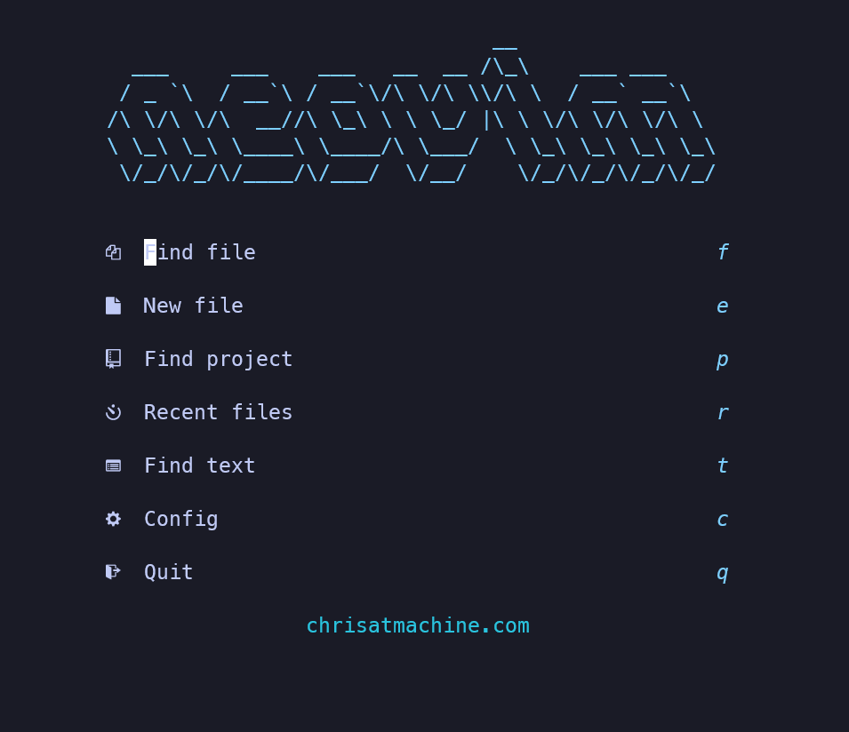

Statt `f` zu drücken, kann man jetzt `Leertaste, e` eingeben und es öffnet sich links eine Art Fileexplorer mit dem man seine Dateien durchsuchen kann.

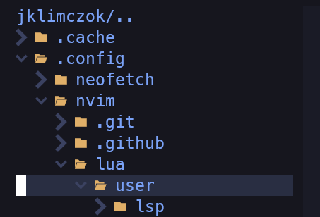

Als erstes sollten wir im Ordner `~/.config/nvim/lua/user` die Datei "plugins.lua" öffnen.

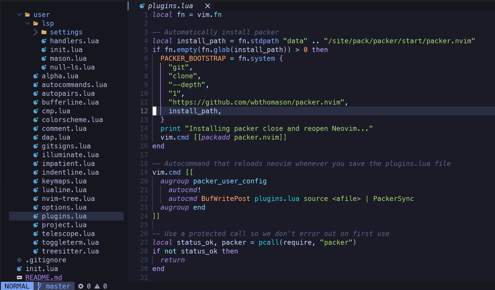

Hier sollten wir nach unten navigieren, bis wir den Punkt "--Automatically set up your configuration ..." erreichen. In den Zeilen davor setzen wir folgendes ein:

```
--Java
use 'mfussenegger/nvim-jdtls'
```

Damit sollte es nun folgendermaßen aussehen:

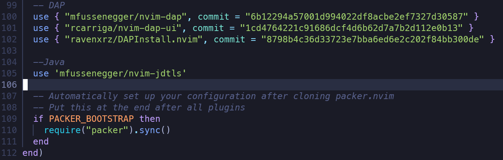

##### Debugger

Nach Speichern per `:w` sollte sich nvim jetzt automatisch updaten und das neue Plugin installieren. Damit dieses auch funktionieren kann, müssen wir als nächstes die Java Debug und VSCode Java Test Extensions von Microsoft installieren. Dafür clonen wir folgende Repos (Sicherstellen, dass wir uns im Ordner `~/.config/nvim` befinden):

- https://github.com/microsoft/java-debug
- https://github.com/microsoft/vscode-java-test

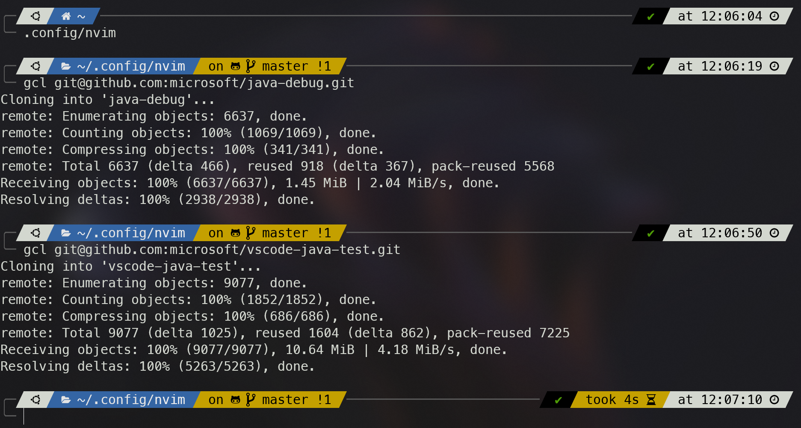

> Einer der Vorteile von zsh und oh-my-zsh ist, dass es viele vorkonfigurierten Alias' für Git hat. Hier sieht man z.B. `gcl` was der Alias für `git clone --recurse-submodules` ist.

Per `cd java-debug` wechseln wir nun in das neue Verzeichnis und installieren mit `./mvnw clean install` den Java Debugger. Sollte Linux eine Fehlermeldung ausgeben, ist es wahrscheinlich, dass Java noch nicht installiert ist (siehe [Java](#Java)), da das Installieren über einen Maven Wrapper durchgeführt wird.

Wenn alles geklappt hat, dauert es ein paar Momente und dann sollte der Java Debugger zur Verfügung stehen.

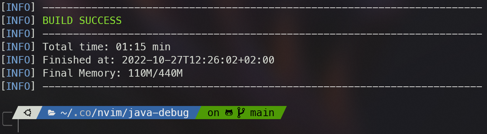

Als nächstes wechseln wir in den vscode-java-test Ordner und installieren diese Extension mit [Node](#Node) folgendermaßen:

```
npm install
npm run build-plugin
```

Auch das wird einige Momente in Anspruch nehmen und sollte die nötigen Dateien aus dem Internet herunterladen. Sollte es hier haken, liegt es evtl. daran, dass Node nicht installiert ist (siehe [Node](#Node)).

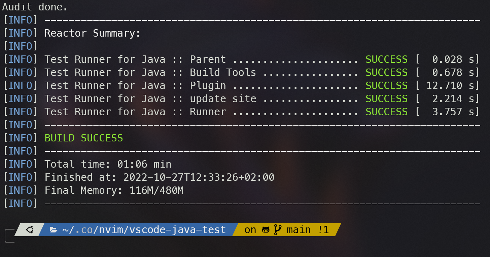

##### ftplugin/java.lua

Für den nächsten Schritt müssen wir den Ordner `~/.config/nvim/ftplugin/` anlegen.

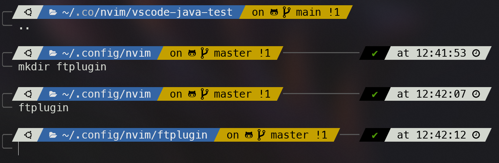

Als nächstes starten wir Neovim und erstellen eine Datei mit dem Befehl `nvim java.lua` (Im ftplugin Ordner)

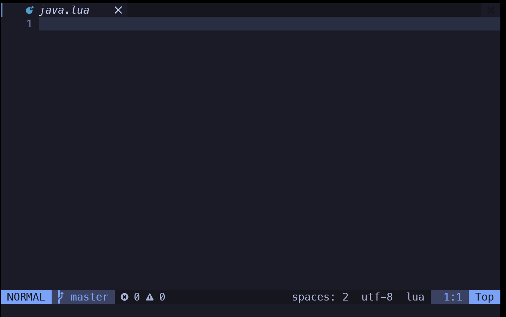

Zu allererst sollten wir die Datei mit `:w` speichern, damit diese auch existiert. Danach müssen wir den gesamten Inhalt aus folgender Datei kopieren und in unsere `java.lua` Datei einfügen (Wenn bis hierher alles funktioniert hat, sollte das Einfügen in Neovim mit der p Taste klappen):

>https://github.com/ChristianChiarulli/nvim/blob/master/ftplugin/java.lua

Als nächstes scrollen wir bis nach fast ganz unten, markieren die Zeilen von `local status_ok, which_key = pcall(require, "which-key")` bis `which_key.register(vmappings, vopts)` und kommentieren diese aus.

>Markieren in nvim: v
>Auskommentieren mehrerer Zeilen: Leer-/

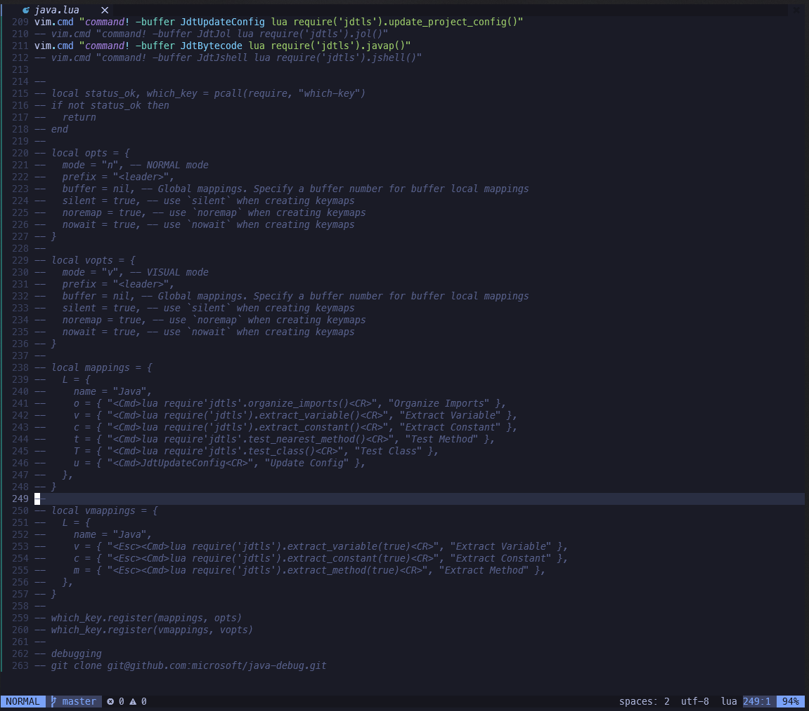

> Anhand der grünen Linien am linken Bildrand erkennen wir, dass Neovim uns bereits Änderungen der Datei anzeigt, die noch nicht per git committed wurden.

Als nächstes installieren wir den Java Language Server mit Mason. Dafür bleiben wir in Neovim und rufen Mason mit `:Mason` auf. Hier sehen wir eine Auswahl von vielen verschiedenen Languageservern für alle Sprachen, die unterstützt werden. Einige, wie html und css sind bereits vorinstalliert, viele andere müssen wir manuell nachinstallieren. So auch den für Java. 

Wir scrollen nach unten, bis sich der Cursor über der Zeile `jdtls` befindet und drücken die Taste `i` zum installieren. Nach ein paar Sekunden, sollte die Neovim Statusleiste "mason.nvim "jdtls' was successfully installed" sagen und jdtls sollte sich unter den installierten Servern wiederfinden.

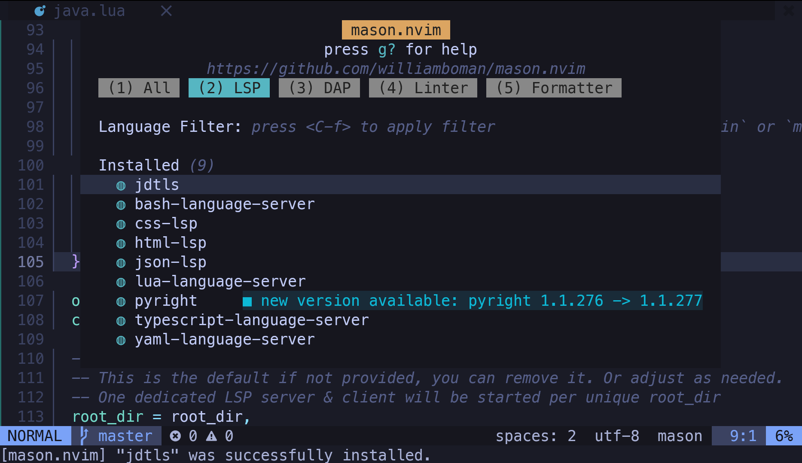

Mit der Taste `q` können wir das Mason Fenster wieder schließen.

Nun müssen wir noch ein paar Zeilen in der Konfigurationsdatei anpassen, da diese leider veraltet ist und nicht mehr zu den korrekten jdtls Installationsordnern zeigt.

Ungefähr in der Mitte der Datei finden wir 4 Bereiche, die mit Totenkopf-Icons markiert sind. Die zwei Punkte, die wir hier anpassen müssen sind mit dem zweiten und dritten Totenkopf markiert: "-jar" und "-configuration".

Unter "-jar" ersetzen wir die Zeile mit Folgendem:

```
vim.fn.glob(home .. "/.local/share/nvim/mason/packages/jdtls/plugins/org.eclipse.equinox.launcher_*.jar"),
```

Und unter "-configuration" ersetzen wir die Zeile mit Folgendem:

```
home .. "/.local/share/nvim/mason/packages/jdtls/config_" .. CONFIG,
```

Ein paar Zeilen weiter oben finden wir eine weitere Zeile in der wir "`/lsp_servers/`"  zu "`/mason/packages/`" ändern, oder wie zuvor die ganze Zeile gegen Folgende austauschen müssen:

```
"-javaagent:" .. home .. "/.local/share/nvim/mason/packages/jdtls/lombok.jar",
```

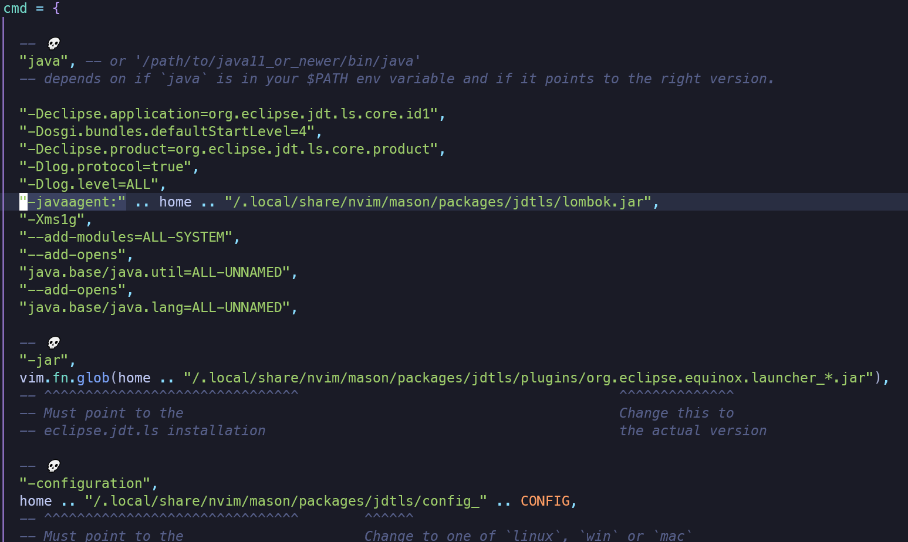

Wenn wir nun die Datei mit `:wq` speichern und schließen und daraufhin eine .java Datei öffnen, sollte nach ein paar Sekunden der Java LSP starten.

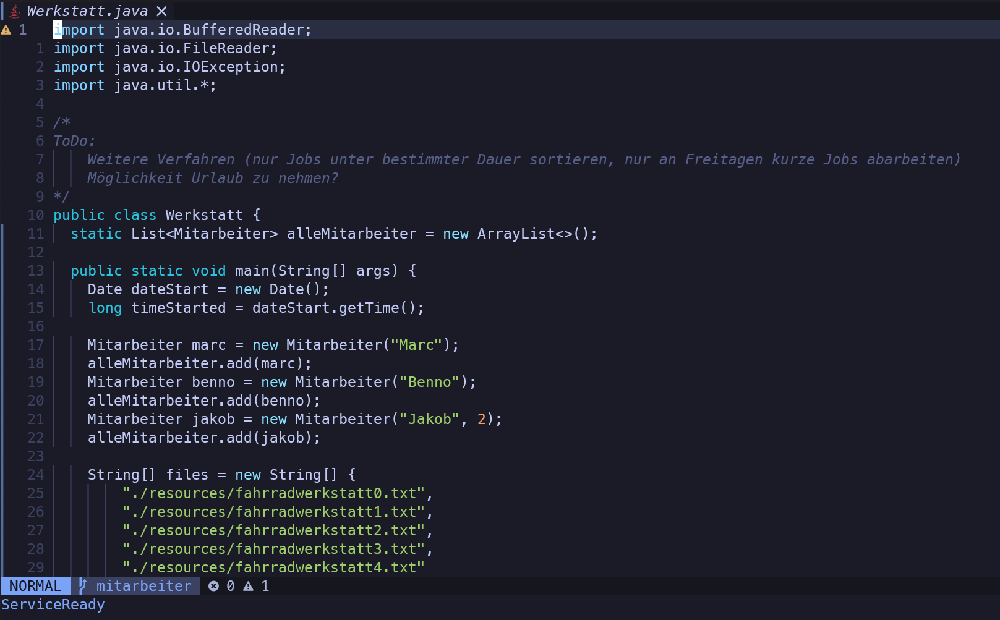

>An dieser Stelle stecke ich aktuell fest und bekomme den Debugger nicht zum Laufen. Updates folgen!
>Wer es selbst testen möchte: Die Tastenfolge "Space-d-b" setzt einen Breakpoint (funktioniert) und "Space-d-c" startet den Debugger (funktioniert aktuell nicht, da die Konfiguration nicht stimmt)