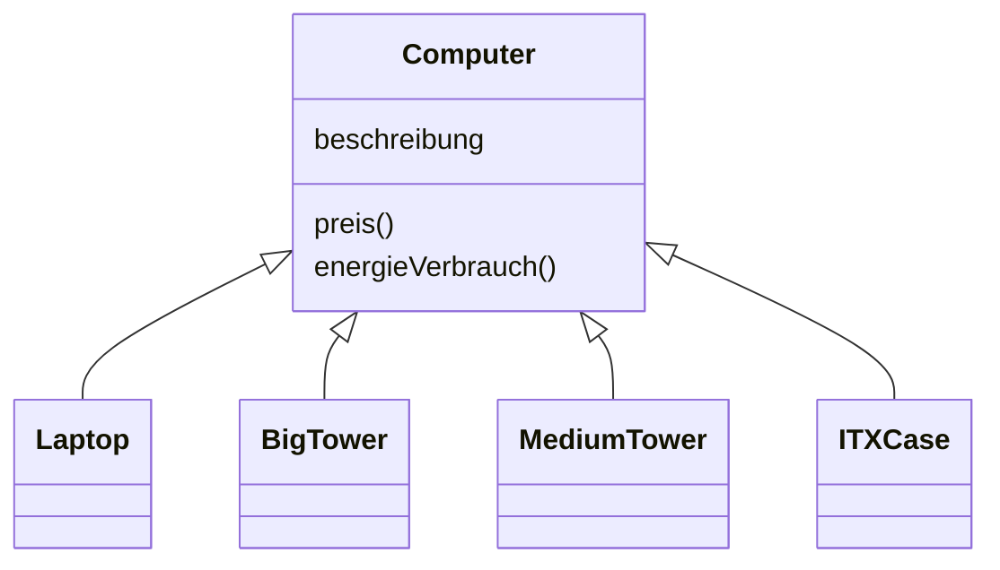

# 18.08. Datenstrukturen und Algorithmen
## Deque

- Double Ended Queue

# 01.09 For Each Schleifen, Iteratoren

Zwischenreflektion: https://schulendortmund.taskcards.app/#/board/4340efd6-835a-42f1-bb6f-355e0ed6b205/view?token=b40a1ec3-760e-4372-a573-09a09eca8f99

# 10.11 - Entwurfsmuster (Designpatterns)

# 12.01 - Entwurfmuster Decorator Pattern

- Eigene Implementierung: PC Konfigurierer

