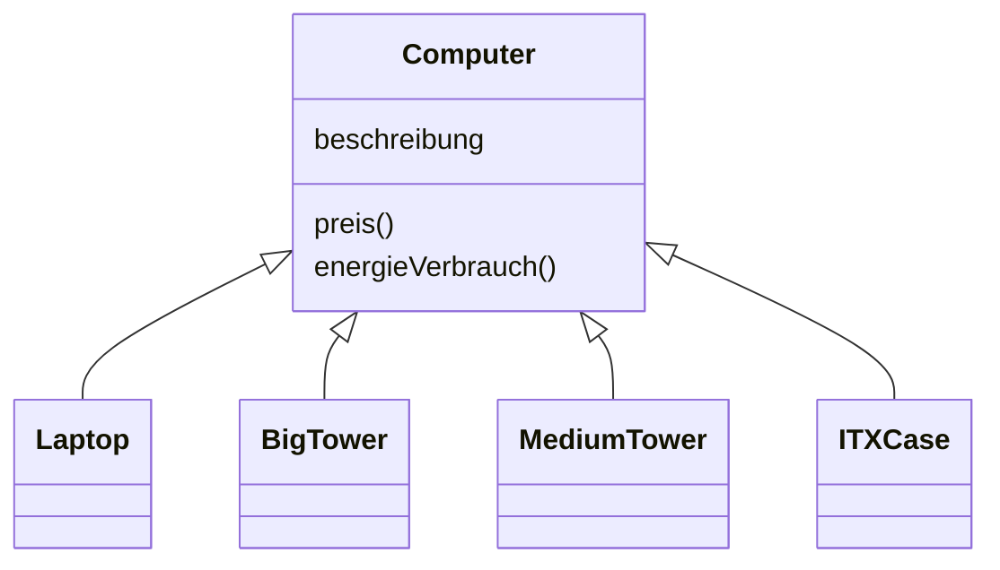
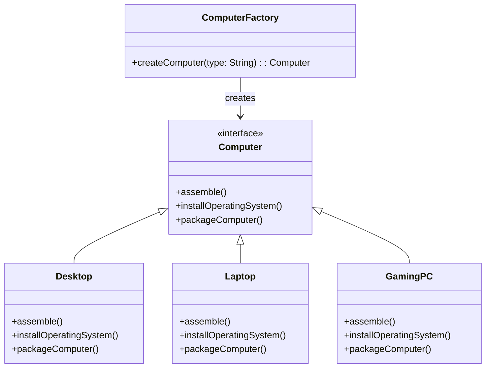
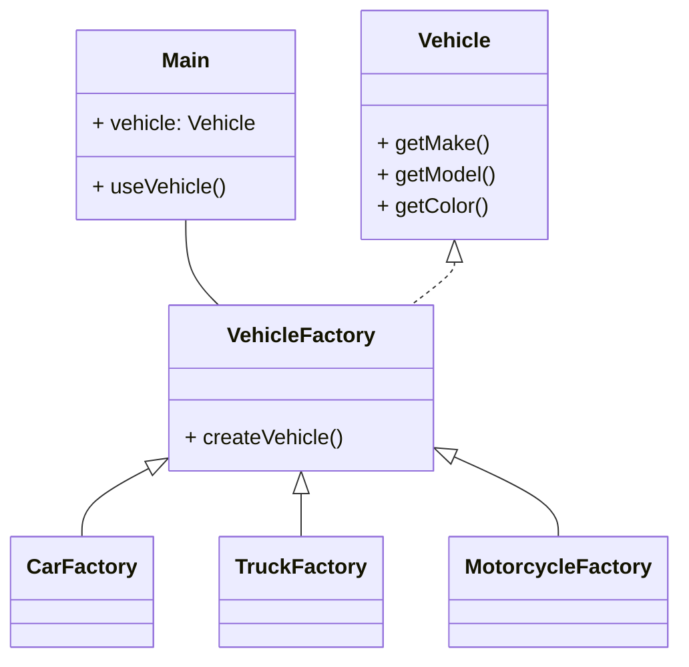

# 18.08. Datenstrukturen und Algorithmen
## Deque

- Double Ended Queue

# 01.09 For Each Schleifen, Iteratoren

Zwischenreflektion: https://schulendortmund.taskcards.app/#/board/4340efd6-835a-42f1-bb6f-355e0ed6b205/view?token=b40a1ec3-760e-4372-a573-09a09eca8f99

# 10.11 - Entwurfsmuster (Designpatterns)

# 12.01 - Entwurfmuster Decorator Pattern

- Eigene Implementierung: PC Konfigurierer

# 9.02 - Factory Pattern

# 23.02 - Prüfungsvorbereitung

![[Übung DesignPattern Vorbereitung Klassenarbeit.pdf]]

## Ziele/Einsatzgebiete der einzelnen Pattern

### Strategy

- Verschiedene Algorithmen/Verhalten einer Klasse lassen sich zur Laufzeit austauschen/aufrufen
- Beim Implementieren von neuen Verhaltensweisen/Algorithmen muss nicht die Hauptklasse verändert werden, bzw. weiter wachsen.
- Stattdessen wird neuer Code zur Strategy Klasse hinzugefügt und die Kontextklasse um einen SwitchCase/If Abfrage ergänzt.
- Spart das Erstellen vieler Klassen, die sich nur in bestimmten Verhaltensweisen unterscheiden, aber sonst gleich sind. Spart duplizierten Code

### Observer

- Es werden sogenannte Publisher implementiert, die eine Liste an Subscribern über bestimmte Veränderungen informieren.
- Subscriber können sich während der Laufzeit auf die Liste setzen oder von der Liste löschen lassen
- Mehrere Publisher sind möglich (Informiere mich per Mail/SMS/Log, etc.)

### Factory

- Wenn ein Programm viele verschiedene Objekte erstellen muss, die zwar alle ein gemeinsames Ziel oder Verhalten aber evtl. verschiedene Wege zu diesem Ziel nutzen (oder dieses Verhalten zu implementieren), dann hilft das Factory Pattern dabei sogenannte Factories zu erstellen, die verschiedene Arten dieser Objekte erstellen
- Dem Nutzer/Klienten kann egal sein, welches Objekt für sein Ziel eingesetzt wird, Hauptsache das Ziel wird erreicht

### Decorator

- Gibt die Möglichkeit, dass Objekte mit Verhalten oder Attributen zur Laufzeit "dekoriert" werden können
- Diese Attribute/Verhalten können auch mehrfach hinzugefügt werden.

## Gemeinsamkeiten/Ergänzungsmöglichkeiten

- Factory & Decorator lassen sich gut ergänzen, da man mit dem Factory Pattern bestimmte Grundobjekte erstellen kann und dann gewünschtes Verhalten/Attribute zur Laufzeit hinzufügen kann.
	- Autofabrik: Factory erstellt PKWs, LKWs, Motorräder etc. und Decorator gibt Farbe, Sitze, Türen etc. (Grundverhalten bleibt gleich, wie Fahren, Hupen, Starten, Stoppen)
	- UI Elemente: Factory erstellt verschiedene Elemente (NavBar, Button) und Decorator fügt Links oder Style hinzu
	- Lineare Abhängigkeit
- Decorator & Observer
	- Messaging Dienst: Observer nötig, damit User sich mit Nachrichtendiensten verbinden können. Je nach Nachrichtendienst können bestimmtes Verhalten mit dem Decoratorpattern hinzugefügt werden (Signaturen bei EMails, Emailadressen, Handynummern bei SMS, maximale Nachrichtenlänge, etc.)
	- Aktienmarkt: Observer lässt bestimmte Aktienkurse abonnieren und Decorator gibt die Möglichkeit die Kurse bestimmt darzustellen (Kuchendiagramm, Zeitachse etc.)
- Factory & Strategy
	- Grafikprogramm: Factory erstellt bestimmte Formen (Square, Circle) und das Strategypattern gibt die Möglichkeit die Rendermethoden auszutauschen (Komplex für das Endprodukt, Simpel für die Vorschau z.B.)