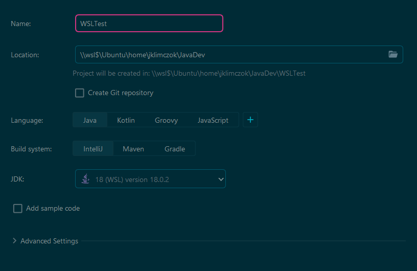

#WSL #Linux #Ubuntu #ArchLinux #Windows #Terminal #Workflow

---
## Inhalt

[Vorwort](#Vorwort)

[Installation WSL2](#Installation-WSL2)
- [Voraussetzungen](#Voraussetzungen)
- [Powershell](#Powershell)
- [Ubuntu](#Ubuntu)
	- [Update & Upgrade des Packagemanagers](#Update--Upgrade-des-Packagemanagers)
	- [Ubuntu auf die neueste Version upgraden](#Ubuntu-auf-die-neueste-Version-upgraden)
	- [Personal Package Archive (PPA)](#Personal-Package-Archive-PPA)

[Verwendung](#Verwendung)
- [Zugriff auf Linuxdateien in Windows](#Zugriff-auf-Linuxdateien-in-Windows)
- [Zugriff auf Windowsdateien in Linux](#Zugriff-auf-Windowsdateien-in-Linux)
- [Remote Development in VSCode](#Remote-Development-in-VSCode)
- [Remote Development in IntelliJ Idea](#Remote-Development-in-IntelliJ-Idea)
- [Apache Server](#Apache-Server)
- [Docker](#Docker)
- [Programme mit graphischer Oberfläche (x11)](#Programme-mit-graphischer-Oberfläche-x11)
- [Development in Neovim](#Development-in-Neovim)
	- [Voraussetzungen für Neovim](#Voraussetzungen-für-Neovim)
		- [unzip](#unzip)
		- [C-Compiler](#C-Compiler)
		- [Java](#Java)
	- [Node](#Node)
		- [nvm](#nvm)
		- [Node & npm installieren](#Node--npm-installieren)
	- [Neovim](#Neovim)
	- [LunarVim](#LunarVim)

[ZSH-Shell & powerlevel10k](#ZSH-Shell--powerlevel10k)
- [ZSH Shell](#ZSH-Shell)
- [Oh-My-ZSH](#Oh-My-ZSH)
- [NerdFonts Meslo](#NerdFonts-Meslo)
- [Powerlevel10k](#Powerlevel10k)
- [Konfiguration ZSH](#Konfiguration-ZSH)
- [Autostart SSH Agent](#Autostart-SSH-Agent)

---

## Vorwort

Kurz vorweg: Dieses Dokument ist im Verlauf mehrerer Wochen entstanden, in denen ich viel Zeit hatte. Manche Teile sind zu Beginn meiner WSL Reise geschrieben worden, manche gegen "Ende". Das sieht man vor Allem an den Screenshots in denen sich die Oberfläche des Terminals immer wieder ändert. Ich bitte das zu entschuldigen, ich hatte zum Ende hin nicht mehr die Muße jeden Screenshot nocheinmal zu ersetzen um dieses Dokument stilistisch uniform zu halten.


## Installation WSL2 

### Voraussetzungen

- Windows Terminal (Kostenlos im Windows Store als Windows Terminal Preview verfügbar)
- Windows 10 - version 2004 (build 19041) oder höher (Auf Quinscape PC's gegeben)
- WSLg: Windows 11

### Powershell

Bei Erstinstallation: `wsl --install` um Ubuntu zu installieren. 
Um eine andere Distribution auszuwählen erst `wsl --list --online` um mögliche Optionen aufzulisten und danach `wsl --install -d <Distribution Name>` um die gewünschte Distro zu installieren. 

Damit lassen sich später auch mehrere Distros gleichzeitig installieren. 


> Wenn WSL bereits installiert ist, funktioniert `wsl --install` nicht. In dem Fall muss man direkt eine Distribution mit `wsl --install -d` auswählen.
> 


Eine weitere Möglichkeit Distros zu installieren (Wenn sie z.B. nicht in der Liste aufgelistet werden), ist es sie als .exe Datei herunterzuladen. Beispiel "Arch Linux": [yuk7/ArchWSL auf Github](https://github.com/yuk7/ArchWSL/releases/latest)

>Um mehrere Installationen der gleichen Distro zu installieren, einfach die .exe Datei kopieren und umbenennen. 
>ArchLinux2.exe wird beispielsweise als ArchLinux2 installiert und kann neben Arch (von Arch.exe) laufen.

### Ubuntu


Sobald man Ubuntu zum ersten Mal gestartet und einen Nutzernamen und ein Passwort gesetzt hat, startet man automatisch im HOME Directory (~). Wenn man möchte kann man auch sofort loslegen, ich persönlich finde es aber etwas zu langweilig und mache mich immer erst daran mit ZSH eine andere Shell zu installieren, die mir die Möglichkeit gibt Plugins zu installieren, welche mir die Konsole etwas aufhübscht. Siehe dazu: [ZSH-Shell & powerlevel10k](#ZSH-Shell-&-powerlevel10k)

#### Update & Upgrade des Packagemanagers

Bevor wir aber weiter machen, sollten wir zunächst Ubuntu und seine Systemwerkzeuge updaten.

Per `sudo apt update` und `sudo apt upgrade -y` sollte Ubuntu sich nach einigen Sekunden auf dem neuesten Stand befinden.

#### Ubuntu auf die neueste Version upgraden

Nachdem wir den Packagemanager geupdated haben, können wir auch Ubuntu auf die neueste Version upgraden. Zum aktuellen Zeitpunkt ist **20.04** die Standard Ubuntu Version, die WSL installiert, die aktuellste aber **22.04**.

Um Ubuntu zu upgraden sollten wir zuerst den Packagemanager upgraden (siehe vorheriger Schritt) und das Terminal neustarten.

Danach können wir Ubuntu per `sudo do-release-upgrade -d` updaten. Dies dauert eine Weile und verlangt wenige Userinputs. Am Ende muss man noch einmal das Terminal neustarten und Ubuntu sollte auf der neuesten Version sein. 

Überprüfen können wir das am **schönsten** mit "neofetch" 
(zu finden per `sudo apt install neofetch`):


#### Personal Package Archive (PPA)

Häufig findet man entweder nicht die gewünschten Programme im Standard Package Manager oder die Versionen sind stark veraltet (siehe [Neovim](#Neovim)).
Um die Auswahl zu erweitern, können wir neben `apt` auch `apt-get` nutzen, um Community Packages per PPA zu installieren.

Um PPA nutzen zu können, müssen wir einfach folgende Dependency installieren (falls sie es nicht schon ist):

```
sudo apt install software-properties-common -y
```

Jetzt können wir per `sudo add-apt-repository ppa:<NAME/REPO> -y` und `sudo apt-get update` inoffizielle Packages in unseren Packagemanager importieren und dann per `sudo apt install <PACKAGE>` installieren.

---

## Verwendung

### Zugriff auf Linuxdateien in Windows

`\\wsl$` im Windows Explorer oder `explorer.exe .` in der WSL Shell (. nicht vergessen!) 


### Zugriff auf Windowsdateien in Linux

Die Systemfestplatte C: wird in WSL direkt gemountet und ist per `cd /mnt/c` aufrufbar


### Remote Development in VSCode

Mit der Remote Development Extension für Microsoft VSCode kann man aus VSCode direkt auf eine Entwicklungsumgebung in Linux (WSL) zugreifen. Dafür startet man zunächst VSCode **in Windows** und installiert die [Extension](https://marketplace.visualstudio.com/items?itemName=ms-vscode-remote.vscode-remote-extensionpack).


Nun kann man in der WSL Shell in ein Verzeichnis navigieren, in dem ein Projekt liegt und dieses dann mit `code .` öffnen (auch hier den Punkt nicht vergessen). 


Hat man einen Ordner im Windows Dateisystem geöffnet, wird man von VSCode darauf hingewiesen die Dateien ins Linux Dateisystem zu kopieren, um auch die vollen Geschwindigkeitsvorteile einer Linux Entwicklungsumgebung genießen zu können.
Wenn alles funktioniert hat, sollte man unten Links in VSCode nun das Remote WSL Icon sehen:


>Wenn man p10k (siehe unten) installiert hat und das VSCode Terminal nutzen möchte, sollte man in den Einstellungen des Terminals die korrekte Schriftart setzen. Im Falle von Meslo sieht das folgendermaßen aus:
>

### Remote Development in IntelliJ Idea

Was in VSCode funktioniert, das geht selbstverständlich auch in IntelliJ und das sogar noch einfacher. So lange WSL2 im Hintergrund aktiv ist, kann man beim erstellen eines neuen Projektes den Speicherort `\\wsl$\..` und die JDK, die man vorher auf dem WSL System installiert hat auswählen. Es wird kein Plugin benötigt.

>Sollte noch keine JDK auf dem WSL System vorhanden sein, wird das hier erklärt: [Java](#Java)




Wie man auf den Screenshots erkennen kann, werden auch Maven und Gradle Projekte unterstützt.

### Apache Server 

Einer der Vorteile an Linux ist es, dass es wesentlich simpler ist einen Apache Webserver aufzusetzen und zum Laufen zu bringen. Das selbe gilt auch für Linux unter WSL.

Alles was wir dafür tun müssen, ist mit `sudo apt install apache2` die Apache2 Software zu installieren und sie mit `sudo service apache2 start` zu starten. Schon läuft im Hintergrund der Server und ist für alle Schandtaten bereit.

>Wenn wir auf den Server im Browser zugreifen möchten, müssen wir unsere IP Adresse herausfinden. Das geht am simpelsten per `ip address`. Die Adresse, die wir suchen, finden wir unter "eth0: inet"
>


Ein paar weitere nützliche Apache2 Befehle:

| Funktion | Befehl |
|-----------|------------------------------|
| Beenden | `sudo service apache2 stop` |
| Neustarten | `sudo service apache2 restart` |
| Status | `sudo service apache2 status` |


### Docker

> Wie ich im Nachhinein erfahren habe, dürfen wir auf den Quinscape Laptops nicht Docker Desktop installieren. Ich lasse diesen kurzen Abschnitt aber trotzdem stehen, um evtl. mögliche Neugierde dahingehend zu wecken.

Eine weitere Möglichkeit WSL zur Entwicklung zu nutzen ist es, Docker im WSL Modus zu nutzen. Das hat den Vorteil, dass man Docker Container direkt im Serverbetrieb testen kann, ohne diese erst auf einen Server zu installieren müssen. Hat man WSL2 installiert, sollte uns Docker die Option geben, den WSL2 Modus zu aktivieren. Hier empfiehlt es sich den Quellcode auch im Linux Dateisystem zu speichern. 

Mehr Informationen dazu in den Docker Docs: [Docker WSL](https://docs.docker.com/desktop/windows/wsl/)

> Eine Sache, die auf Windows 10 (zumindest auf den QS Laptops) leider nicht möglich ist, ist es den Docker Container im Netzwerk freizugeben. Windows versteckt die Linux IP hinter der Firewall und um diese offenzulegen, ist zu viel Manipulation an der Firewall nötig. Einfacher ist es auf Windows 11, da man hier die Möglichkeit hat per Hyper-V eine Brücke zwischen beiden IP's aufzubauen. 

### Programme mit graphischer Oberfläche (x11 & Wayland)

Auf Windows 11 lassen sich mit WSL graphische Programme starten und wie Desktop Apps starten. Um das auch auf Windows 10 zu können, muss man leider zusätzlich einen X11 Server installieren. 

Den Server auf Win10 zu installieren übertrifft leider den scope dieses Dokuments und auch meiner technischen Expertise, sollte aber jemand in einer fernen Zukunft hierher zurückfinden, in der Quinscape Windows 11 unterstützt, kann man das folgendermaßen testen:

```
sudo apt install x11-apps -y
```

Damit installieren wir rudimentäre Programme mit graphischer Oberfläche. Zwei davon sind xcalc und xclock, die man jeweils mit `xcalc`, respektive `xclock` starten kann. 
Wenn das funktioniert, dann sollte man auch Programme wie GIMP oder Audacity etc. installieren können.


### Development in Neovim

Dieser Punkt ist sehr umfassend, sehr optional und sehr "Work in Progress". Er ist unterteilt in mehrere Unterpunkte: Voraussetzungen, NeoVim und der Alternative zur manuellen Konfiguration LunarVim. 

>Dieser Punkt ist optional und zeigt was nur in einer Konsole dank einer sehr eifrigen Community möglich ist. Der einzige Vorteil gegenüber klassischen IDE's ist maximal, dass man sich seine eigene IDE zusammenbauen und auf jegliche Ablenkungen verzichten kann, die man nicht benötigt und gleichzeitig lernt aus wie vielen Einzelteilen eine IDE heutzutage besteht.
>Viele Programmierer bevorzugen das Entwickeln in Neovim, aber es ist bei weitem nicht jedermanns Sache.


### Voraussetzungen für Neovim

Damit die folgenden Punkte funktionieren können, müssen wir auf Ubuntu `unzip` und einen C-Compiler installieren.

#### unzip

`unzip` erhalten wir mit `sudo apt install unzip`

#### C-Compiler

Der einfachste Weg einen C Compiler zu installieren, ist es das build essentials Package zu installieren. Dies geht mit folgendem Befehl:

```
sudo apt-get update && sudo apt-get install build-essential
```

#### Java

Bevor wir Neovim für die Java Entwicklung nutzen können, benötigen wir natürlich eine aktuelle Version von Java. Diese können wir per `sudo apt search JSK` suchen. Ich habe mich hier für die openjdk-18-jdk entschieden.

Mit `sudo apt install openjdk-18-jdk` kann man die JDK Version 18 installieren und sofort nutzen.


#### Node

##### nvm

Zunächst installieren wir den Node Version Manager nvm:

```
curl -o- https://raw.githubusercontent.com/nvm-sh/nvm/v0.37.2/install.sh | zsh
```

Danach starten wir die Shell neu mit `exec zsh` und schon können wir nvm nutzen.

Mit `command -v nvm` können wir überprüfen, ob alles funktioniert hat. Sollte dies der Fall sein, sollte dem Befehl die Ausgabe `nvm` folgen. 
Die aktuelle Version von nvm erfragen wir per `nvm --version`


##### Node & npm installieren

Mit nvm können wir nun per `nvm install node` Node installieren.


Mit Node sollte nun auch npm installiert sein. Überprüfen können wir das per `npm -v`


### Neovim

Eigentlich stand hier ein ellenlanger Absatz darüber wie man Neovim so konfiguriert, dass man es als eigenständige IDE nutzen kann, da ich aber nicht herausfinden kann, wie man den Debugger funktionierend installieren kann, habe ich diesen verschoben und setze hier nur einen Verweis dorthin: [Neovim (Work in Progress)](Neovim%20(Work%20in%20Progress).md)

Da Neovim relativ neu und die Community sehr aktiv ist, werden beinahe monatlich neue Versionen des Programms und täglich neue Versionen der Plugins hochgeladen, daher ist es fast unmöglich eine stabile IDE zusammenzusetzen. 


### LunarVim

Eine aktuell simplere Lösung Neovim als IDE nutzen zu können ist es, LunarVim zu installieren. Das hat den Vorteil, dass man nach Installation aller Voraussetzungen nur noch einen Skript abrufen muss, das uns ein Neovim Paket installiert, welches vorkonfiguriert ist:

[LunarVim Homepage](https://www.lunarvim.org/)

Dort findet man eine detaillierte Installationsanweisung und eine Dokumentation, wie man Lvim einstellen kann. Sobald mir klar geworden ist, wie ich den Java Debugger (und Testumgebung) konfigurieren kann, werde ich das hier nachreichen.


---

## ZSH-Shell & powerlevel10k

### ZSH Shell

`sudo apt install zsh` um die zsh Shell zu installieren und danach `zsh` um zsh zu starten. Beim ersten Start wird die Konfiguration aufgerufen:


### Oh-My-ZSH

Sobald diese abgeschlossen ist, sollte man "oh-my-zsh" installieren, damit es in Zukunft leichter ist Plugins zu aktivieren:

```
sh -c "$(curl -fsSL https://raw.githubusercontent.com/robbyrussell/oh-my-zsh/master/tools/install.sh)"
```

Dadurch bekommt man auch die Option ZSH als Standard Shell zu aktivieren.


### NerdFonts Meslo

Spätenstens für den nächsten Schritt benötigt man eine Schriftart, die Icons unterstützt. Empfohlen wird "Meslo NF", auf [nerdfonds.com](https://www.nerdfonts.com) werden aber viele weitere angeboten. Hier kann [MesloNF](https://github.com/romkatv/dotfiles-public/raw/master/.local/share/fonts/NerdFonts/MesloLGS%20NF%20Regular.ttf) direkt heruntergeladen werden.

Nach der Installation muss diese im Terminal eingestellt werden. In Windows Terminal geht das unter `Settings > Profiles > Defaults > Appearence > Text > Font face` 


### Powerlevel10k

Als letzten Schritt muss jetzt nur noch powerlevel10k installiert werden. Dafür aus dem Homedirectory (~ oder cd ~) folgendes aufrufen:

```
git clone --depth=1 https://github.com/romkatv/powerlevel10k.git $ZSH_CUSTOM/themes/powerlevel10k
```

Als nächstes muss man p10k noch in der Konfigurationsdatei von zsh als Theme setzen. Dafür ruft man per `nano .zshrc` oder `vim .zshrc` die Datei auf und sucht nach folgender Zeile

```
ZSH_THEME="robburussell"
```

Diese ersetzt man mit folgendem:

```
ZSH_THEME="powerlevel10k/powerlevel10k"
```

Um die Shell neuzustarten, gibt man nun `exec zsh` ein und es sollte die Erstkonfiguration von powerlevel10k starten. Man kann diese aber auch manuell per `p10k configure` aufrufen.


Wenn alles korrekt eingestellt ist, könnte die Shell jetzt etwa so ausschauen:


### Konfiguration ZSH

Die ZSH Shell lässt sich sehr einfach konfigurieren. Dafür ruft man mit einem beliebigen Textbearbeitungsprogramm die Datei `~/.zhsrc` auf (z.B. `nano ~/.zshrc` oder `nvim ~/.zhsrc`) und fügt dort eigene Zeilen hinzu. Welche zur Verfügung stehen, findet man direkt dort in den Kommentaren. 

Hier ein paar Zeilen, die ich eingefügt habe:

```
alias zshconfig="lvim ~/.zshrc"
alias c="clear"
alias vim="lvim"
alias v="lvim"
alias ez="exec zhs"
```

Dies ist eine Ansammlung von Alias', die mir das Leben vereinfachen. 

Außerdem habe ich weitere Alias', die mich mit nur einem Buchstaben in den Windows Dokumenten Ordner bringen, damit ich nicht jedesmal `cd mnt/c/user/username/Documents/Foo/Bar/` eingeben muss.

Eine weitere Vereinfachung, um Repos schnell mit Git und Github zu verarbeiten lautet wie folgt:

```
gacp() {
  git add -A && git commit -m "Laptop Backup $(date)" && git push
}
```

Diese ist offensichtlich nicht für Repos gedacht, die code beinhalten, sondern für solche, die keine besonderen Commitmessages benötigen. Was diese kurze Skript nämlich macht ist automatisch alle Änderungen adden, committen und pushen mit nur einem Befehl. Die Commitnachricht, die hier angefügt wird, ist ein simpler Zeitstempel. Ich nutze diesen Befehl hauptsächlich für diese Notizen, da mich nicht interessiert, was genau geändert wurde.

Auf meinem privaten PC habe ich diesen Befehl natürlich angepasst und statt Laptop "Desktop" hineingeschrieben.


### Autostart SSH Agent

Wenn man mit SSH Keys arbeiten möchte (z.B. für GitHub) muss man in WSL leider jedesmal den SSH Agent starten und die SSH Keys einlesen. Um das zu vereinfachen empfehle ich dies in den Autostart zu skripten.

Meine Lösung hier war es die Konfiguration von ZSH aufzurufen und folgende Befehle an den Anfang der Datei zu setzen:

```

# start ssh agent on startup and add keys
eval $(ssh-agent) > /dev/null
ssh-add ~/.ssh/path/to/keys > /dev/null 2>&1

```

Dies wird bei jedem Starten oder Neuladen der Shell den Agent starten, die ssh Keys aus dem entsprechenden Ordner einlesen und diese direkt verfügbar machen. Wichtig ist es den Ordner in dem die Keys liegen zu ändern.

Außerdem versteckt diese Konfiguration die Ausgabe in die Konsole. Ohne die Anhänge `> dev/null` 
sieht man jedesmal beim Neustart der Shell auch die Konsolenausgabe.


---

## Weiterführende Links

- [Übersicht Plugins für oh-my-zsh](https://github.com/ohmyzsh/ohmyzsh/wiki/Plugins)
- [Neovim Cheat Sheet](https://github.com/mattmc3/neovim-cheatsheet)
- [Youtube: Dave's Garage - Windows and Linux: Together at Last](https://www.youtube.com/watch?v=clZCrVZH4Gg)
- [Youtube: The Digital Life - Install Kali Linux - WSL2 KEX GUI hacking setup](https://www.youtube.com/watch?v=_cXmx2qwWts)
- [Youtube: Devaslife - Set up Neovim on a new M2 MacBook Air for coding React, TypeScript, Tailwind CSS, etc.](https://www.youtube.com/watch?v=ajmK0ZNcM4Q)
- [Youtube: Nick Janetakis - A Linux Dev Environment on Windows with WSL 2, Docker Desktop and More](https://www.youtube.com/watch?v=idW-an99TAM)
- 

---

## Quellen/Referenzen

- [WSL Setup Microsoft](https://learn.microsoft.com/en-us/windows/wsl/install)
- [Installation von NVM und Node](https://www.linode.com/docs/guides/how-to-install-use-node-version-manager-nvm/#installing-and-configuring-nvm)
- [Installation von npm in Linux](https://www.linode.com/docs/guides/install-and-use-npm-on-linux/)
- [Upgrade Ubuntu](https://www.linuxtechi.com/upgrade-ubuntu-20-04-to-ubuntu-22-04/)
- [Neovim installieren](https://www.linuxcapable.com/how-to-install-neovim-editor-on-ubuntu-22-04-lts/)
- [Packages in Ubuntu deinstallieren](https://phoenixnap.com/kb/uninstall-packages-programs-ubuntu)
- [LSP Java Unterstützung für NVIM](https://github.com/mfussenegger/nvim-jdtls)
- [java.lua Konfiguration](https://github.com/ChristianChiarulli/nvim/blob/master/ftplugin/java.lua)
- 

---